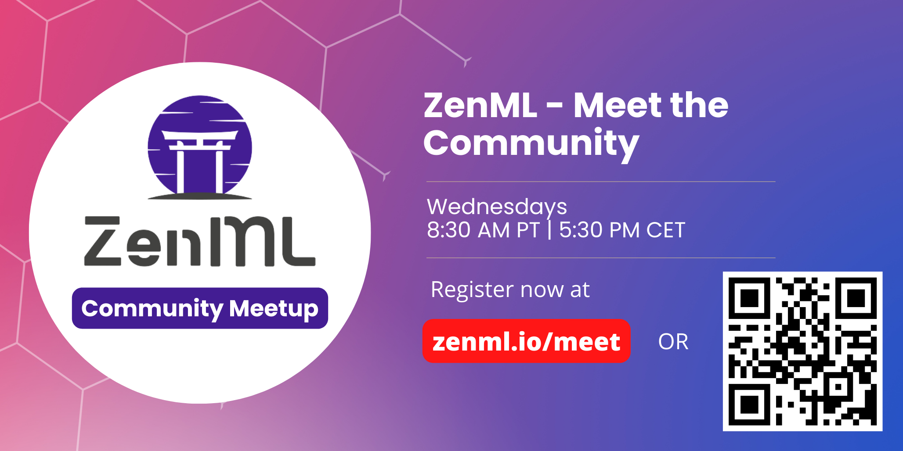

<!-- PROJECT LOGO -->
<br />
<div align="center">
  <a href="https://zenml.io">
    
  </a>

  <h3 align="center">Open-source companion dashboard for
   <a href="https://github.com/zenml-io/zenml">ZenML</a>.
  </h3>
  
  <p align="center">
    Manage and visualize your ML pipelines, stacks and artifacts in one place.
    <br />
    <a href="https://docs.zenml.io/"><strong>Explore the docs »</strong></a>
    <br />
    <div align="center">
      Join our <a href="https://zenml.io/slack-invite" target="_blank">
      
    <b>Slack Community</b> </a> and be part of the ZenML family.
    </div>
    <br />
    <a href="https://zenml.io/features">Features</a>
    ·
    <a href="https://zenml.io/roadmap">Roadmap</a>
    ·
    <a href="https://github.com/zenml-io/zenml-dashboard/issues">Report Bug</a>
    ·
    <a href="https://zenml.io/discussion">Vote New Features</a>
    ·
    <a href="https://blog.zenml.io/">Read Blog</a>
    ·
    <a href="#-meet-the-team">Meet the Team</a>
    <br />
    🎉 Version 0.1.0 is out. Check out the release notes
    <a href="https://github.com/zenml-io/zenml-dashboard/releases">here</a>.
    <br />
    <br />
    <a href="https://www.linkedin.com/company/zenml/">
    
    </a>
    <a href="https://twitter.com/zenml_io">
    
    </a>
  </p>
</div>

<!-- TABLE OF CONTENTS -->
<details>
  <summary>🏁 Table of Contents</summary>
  <ol>
    <li>
      <a href="#-getting-started">⚡ Getting Started</a>
      <ul>
        <li><a href="#-installation">🔋 Installation</a></li>
        <li><a href="#-relationship-with-zenml">👨‍👦 Relationship with ZenML</a></li>
        <li><a href="#-deploying-the-dashboard">🪐 Deploying the dashboard</a></li>
      </ul>
    </li>
    <li>
    <a href="#-user-experience">🏄 User Experience</a>
    <ul>
        <li><a href="#-log-in">🔐 Log In</a></li>
        <li><a href="#-homepage">🏠 Home Page</a></li>
        <li><a href="#-pipeline-stacks-and-components">🗂 Pipeline, Stacks and Components</a></li>
      </ul>
    </li>
    <li><a href="#-contributing-and-community">🙌 Contributing</a></li>
    <li><a href="#-meet-the-team">👩‍👩‍👧‍👦 Meet the Team</a></li>
    <li><a href="#-getting-help">🆘 Getting Help</a></li>
    <li><a href="#-license">📜 License</a></li>
  </ol>
</details>

<br />


# ⚡ Getting Started

## 🔋 Installation

The installation is as follows:

First, there is a pre-requisite to use [`npm`](https://www.npmjs.com/) version 14.20.0 exactly. One can do this by installing the [`nvm`](https://github.com/nvm-sh/nvm) utility and then doing 

```
nvm install 14.20.0
nvm use 14.20.0
```

Users also need to have [`yarn`](https://yarnpkg.com/) installed.

Then you can run it by doing:

```
yarn install
yarn start
```

To build it:

```
yarn build
```

The app takes the following env variables:

```
REACT_APP_BASE_API_URL="<YOUR_ZENML_SERVER_DEPOLOYMENT_URL>/api/v1"
```

To learn how to get the `YOUR_ZENML_SERVER_DEPOLOYMENT_URL`, read the [deployment guide](https://docs.zenml.io/getting-started/deploying-zenml/deployment).

Lastly, if you would like to use Docker, then the ZenML team provides [DockerHub] images to serve the ZenML Server and Dashboard in one image:

```shell
docker run -it -d -p 8080:80 zenmldocker/zenml-server
```

Which will serve the dashboard with the server at `http://localhost:8080`, with username `default` and an empty password.

## 👨‍👦 Relationship with ZenML

The ZenML Dashboard is a Javascript React-based application that lives inside this repository, which is a sister repository of the main [ZenML Python package repo](https://github.com/zenml-io/zenml). The dashboard is meant to be used with the ZenML Server as a backend and cannot be used standalone.

The dashboard build files come bundled into the [ZenML PyPi package](https://pypi.org/project/zenml/) and can be [served locally](https://docs.zenml.io/getting-started/deploying-zenml/using-cli.md) and/or [deployed on the cloud](https://docs.zenml.io/getting-started/deploying-zenml/deployment.md) through the main ZenML python package.

Basically, each ZenML `Python` package comes with the build files (generated by `yarn build`) of a certain version of this dashboard (all build files of the dashboard can be seen in the [releases](https://github.com/zenml-io/zenml-dashboard/releases) section of this GitHub repo). Therefore, each ZenML PyPi package has bundled in it a corresponding version of this dashboard.

With the `Python` package, you can then serve these static build files by doing:

```
zenml up
```


Which creates a local daemon that serves the files in a FastAPI server!

## 🪐 Deploying the dashboard

You can deploy this dashboard on supported cloud providers with ZenML python package by using the command: 

```
zenml deploy
```

The above command deploys the dashboard in the [same process as the ZenML Server](https://docs.zenml.io/getting-started/deploying-zenml/deployment.md), and automates a lot of the nitty gritties for you.

However, the option to deploy standalone is also available. `yarn build` creates a build directory with a production build of the dashboard. Set up your favorite HTTP server so that a visitor to your site is served index.html. Here are [8 ways to deploy a React app for free](https://blog.logrocket.com/8-ways-deploy-react-app-free/) as a starting point.

Just don't forget to the set the `REACT_APP_BASE_API_URL` environment variable!

# 🏄 User Experience

## 🔐 Log In


## 🏠 Home Page


## 🗂 Pipelines, Stacks and Components


# 🙌 Contributing

We would love to develop ZenML together with our community! Best way to get
started is to select any issue from the [`good-first-issue`
label](https://github.com/zenml-io/zenml-dashboard/labels/good%20first%20issue). 

If you would like to contribute, please review our [Contributing
Guide](CONTRIBUTING.md) for all relevant details.


# 👩‍👩‍👧‍👦 Meet the Team



Have a question that's too hard to express on our Slack? Is it just too much effort to say everything on a 
long GitHub issue? Or are you just curious about what ZenML has been up to in the past week? 

Well, register now for the ZenML Meet the Community session to get your answers!
It's free and open to everyone.

Every week, the ZenML [core team](https://zenml.io/company#CompanyTeam) will pop in for 30 minutes to interact directly with the community. 
Sometimes we'll be presenting a feature, other times we'll take questions and have fun. 

Join us if you are curious about ZenML, or just want to talk shop about MLOps.

We will host the gathering every Wednesday 8:30AM PT (5:30PM CET). 
Register now through [this link](https://www.eventbrite.com/e/zenml-meet-the-community-tickets-354426688767), 
or subscribe to the [public events calendar](https://calendar.google.com/calendar/u/0/r?cid=Y19iaDJ0Zm44ZzdodXBlbnBzaWplY3UwMmNjZ0Bncm91cC5jYWxlbmRhci5nb29nbGUuY29t) to get notified 
before every community gathering.

# 🆘 Getting Help
By far the easiest and fastest way to get a response is to:

1. Ask your questions in [our Slack group](https://zenml.io/slack-invite/).
2. [Open an issue](https://github.com/zenml-io/zenml-dashboard/issues/new/choose) on our GitHub repo.


# 📜 License

ZenML Dashboard is distributed under the terms of the Apache License Version 2.0. 
A complete version of the license is available in the [LICENSE](LICENSE) file in
this repository. Any contribution made to this project will be licensed under
the Apache License Version 2.0.
