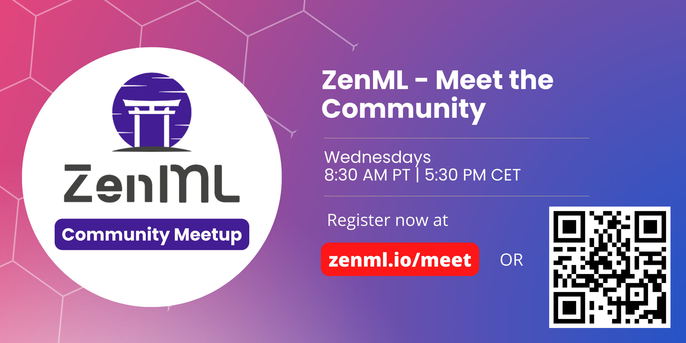

<!-- PROJECT LOGO -->
<br />
<div align="center">
   <a href="https://zenml.io">
   
   </a>
   <h3 align="center">Open-source companion dashboard for
      <a href="https://github.com/zenml-io/zenml">ZenML</a>.
   </h3>
   <h3 align="center">Build portable, production-ready MLOps pipelines.</h3>
   <p align="center">
   <div align="center">
      Join our <a href="https://zenml.io/slack-invite" target="_blank">
      
      <b>Slack Community</b> </a> and be part of the ZenML family.
   </div>
   <br />
   <a href="https://zenml.io/features">Features</a>
   ·
   <a href="https://zenml.io/roadmap">Roadmap</a>
   ·
    <a href="https://github.com/zenml-io/zenml-dashboard/issues">Report Bug</a>
   ·
   <a href="https://zenml.io/discussion">Vote New Features</a>
   ·
   <a href="https://blog.zenml.io/">Read Blog</a>
   ·
   <a href="https://www.zenml.io/company#team">Meet the Team</a>
   <br />
   <br />
   </p>
</div>

---


# ⚡ Getting Started

## 🔋 Installation

To get started with the ZenML Dashboard, follow these steps:

1. **Install Node.js (v18):**
   - Ensure you have Node.js installed. You can either install version 18 directly or use [nvm (Node Version Manager)](https://github.com/nvm-sh/nvm) with the following commands:

     ```bash
     nvm install 18
     nvm use 18
     ```

2. **Install Yarn:**
   - The project uses Yarn as the package manager. Install it with:

     ```bash
     npm install -g yarn
     ```

3. **Install Dependencies:**
   - Navigate to the project directory and install dependencies:

     ```bash
     yarn install
     ```

4. **Set Environment Variable:**
   - Configure the environment variable `REACT_APP_BASE_API_URL` by replacing `<YOUR_ZENML_SERVER_DEPLOYMENT_URL>` with your ZenML Server deployment URL. Example:

     ```bash
     export REACT_APP_BASE_API_URL="https://your-zenml-server-url/api/v1"
     ```

5. **Run Development Server:**
   - For development, run the server with:

     ```bash
     yarn start
     ```

   - Alternatively, build the project for production with:

     ```bash
     yarn build
     ```

6. **Using Docker (Optional):**
   - ZenML provides Docker images for the server and dashboard. Run the following command to serve both:

     ```bash
     docker run -it -d -p 8080:80 zenmldocker/zenml-server
     ```

   - Access the dashboard at `http://localhost:8080` with the username `default` and an empty password.

For detailed deployment instructions and additional options, refer to the [deployment guide](https://docs.zenml.io/user-guide/starter-guide/switch-to-production).

Now you're ready to explore and visualize your ML pipelines, stacks, and artifacts with the ZenML Dashboard!


# 🤝 ZenML Dashboard Integration

The ZenML Dashboard is a Javascript React-based application designed to seamlessly integrate with the main [ZenML Python package](https://github.com/zenml-io/zenml). It serves as a unified platform for managing and visualizing your ML pipelines, stacks, and artifacts in one centralized location.

## Integration Overview

The ZenML Dashboard is intricately connected with the ZenML Server as its backend and is not intended for standalone use. Here's a brief overview of how it fits into the ZenML ecosystem:

- **Sister Repository:**
  - The dashboard resides in this repository, acting as a sister repository to the main [ZenML Python package repo](https://github.com/zenml-io/zenml).

- **Bundled Build Files:**
  - The dashboard build files are bundled into the [ZenML PyPi package](https://pypi.org/workspace/zenml/) and are included with each version of the ZenML Python package. These build files, generated by `yarn build`, correspond to specific versions of the dashboard.

- **Local Deployment:**
  - Serve the static build files locally using the ZenML Python package:

    ```bash
    zenml up
    ```

    This creates a local daemon that serves the files in a [FastAPI](https://github.com/tiangolo/fastapi) server.


## 🪐 Deploying the dashboard

You can deploy this dashboard on supported cloud providers with ZenML python package by using the command:

```
zenml deploy
```

The above command deploys the dashboard in the [same process as the ZenML Server](https://docs.zenml.io/user-guide/starter-guide/switch-to-production) and automates a lot of the nitty-gritty for you.

However, the option to deploy standalone is also available. `yarn build` creates a build directory with a production build of the dashboard. Set up your favorite HTTP server so that a visitor to your site is served index.html. Here are [8 ways to deploy a React app for free](https://blog.logrocket.com/8-ways-deploy-react-app-free/) as a starting point.

Just don't forget to set the `REACT_APP_BASE_API_URL` environment variable!

# 🏄 User Experience

## 🔐 Log In

Logging into the ZenML Dashboard is a simple process. Navigate to the login page and enter your credentials.

## 🏠 Home Page

Once logged in, you'll be directed to the dashboard's home page. This page provides an overview of your projects, pipelines, and recent activities.

## 🗂 Pipelines, Stacks, Components and other resources

Explore your machine learning artifacts effortlessly. The dashboard offers a structured view of your pipelines, stacks, components, etc... making it easy to manage and visualize your workflows.

This combination of a user-friendly interface and visualizations enhances your experience, helping you navigate and understand your machine learning processes efficiently.


# 🙌 Contributing

We would love to develop ZenML together with our community! The best way to get
started is to select any issue from the [`good-first-issue`
label](https://github.com/zenml-io/zenml-dashboard/labels/good%20first%20issue).

If you would like to contribute, please review our [Contributing
Guide](CONTRIBUTING.md) for all relevant details.

# 👩‍👩‍👧‍👦 Meet the Team

Get to know the faces behind ZenML. Our dedicated team is passionate about creating tools that empower your machine learning journey.



Every week, the ZenML [core team](https://zenml.io/company#CompanyTeam) spends 30 minutes interacting directly with the community. This time may involve feature presentations, Q&A sessions, or just casual discussions.

[Register now](https://zenml.io/meet) for the ZenML Meet the Community session. It's free and open to everyone.

You can also subscribe to our [public events calendar](https://calendar.google.com/calendar/u/0/r?cid=Y19iaDJ0Zm44ZzdodXBlbnBzaWplY3UwMmNjZ0Bncm91cC5jYWxlbmRhci5nb29nbGUuY29t) to stay informed about upcoming community gatherings.

Join us and become part of the ZenML community!


# 🆘 Getting Help

Need a helping hand? We've got you covered! Getting assistance with ZenML is quick and easy.

1. **Join our Slack Community:**
   - Our lively Slack community is buzzing with friendly faces and helpful discussions. Drop by, ask questions, and connect with fellow enthusiasts. [Get your invite](https://zenml.io/slack-invite/).

2. **Open an Issue:**
   - Have a specific problem or found a bug? Open an issue on our [GitHub repo](https://github.com/zenml-io/zenml-dashboard/issues/new/choose). Our team and community members regularly monitor and respond.

3. **Check the Documentation:**
   - Explore our comprehensive [documentation](https://docs.zenml.io/) for in-depth guides, tutorials, and troubleshooting tips. It's a treasure trove of knowledge to empower your ZenML journey.

# 📜 License

ZenML Dashboard is distributed under the terms of the Apache License Version 2.0.
A complete version of the license is available in the [LICENSE](LICENSE) file in
this repository. Any contribution made to this workspace will be licensed under
the Apache License Version 2.0.
